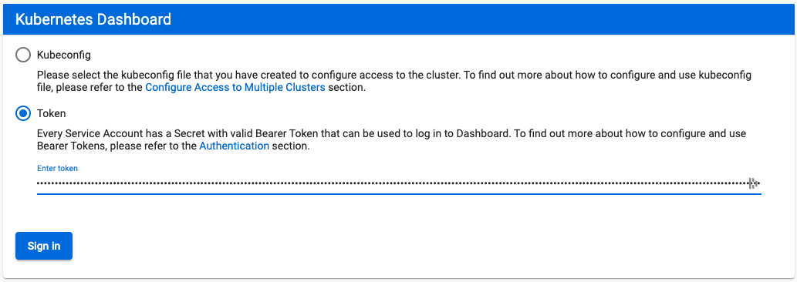

# LAB - Setting up Kubernetes Cluster with Kubeadm  

This documents describes how to setup kubernetes from scratch on your own nodes, without using a managed service. This setup uses **kubeadm** to install and configure kubernetes cluster.

## Compatibility

Kubernetes is an open-source system for automating deployment, scaling, and management of containerized applications.

The below steps are applicable for the below mentioned OS


| OS | Version | Codename |  
| --- | --- | -- |  
| **Ubuntu** | **16.04 / 18.04** | **Xenial** |  


## Initializing Master

This tutorial assumes **kube-01**  as the master and used kubeadm as a tool to install and setup the cluster. This section also assumes that you are using vagrant based setup provided along with this tutorial. If not, please update the IP address of the master accordingly.

To initialize master, run this on kube-01 (1st node)

`replace 192.168.56.101 with the actual IP of your node`

```
kubeadm init --apiserver-advertise-address 192.168.56.101 --pod-network-cidr=192.168.0.0/16

```

### Initialization of the Nodes (Previously Minions)

After master being initialized, it should display the command which could be used on all worker/nodes to join the k8s cluster.

e.g.
```
kubeadm join --token c04797.8db60f6b2c0dd078 192.168.12.10:6443 --discovery-token-ca-cert-hash sha256:88ebb5d5f7fdfcbbc3cde98690b1dea9d0f96de4a7e6bf69198172debca74cd0
```
`dont copy above command as is, this is just a sample, use actual`

Copy and paste it on all node.


### Setup the admin client - Kubectl


`on Master Node`

```
mkdir -p $HOME/.kube
sudo cp -i /etc/kubernetes/admin.conf $HOME/.kube/config
sudo chown $(id -u):$(id -g) $HOME/.kube/config
```

Validate

```
kubectl get nodes
```

You could also put the above command on a watch to observe the nodes getting ready.

```
watch kubectl get nodes
```

## Setup Networking with Calico Plugin

Installing overlay network is necessary for the pods to communicate with each other across the hosts. It is necessary to do this before you try to deploy any applications to your cluster.

There are various overlay networking drivers available for kubernetes. We are going to use **Calico**.

```

kubectl apply -f https://docs.projectcalico.org/v3.11/manifests/calico.yaml


```


## Validating the Setup

You could validate the status of this cluster, health of pods and whether all the components are up or not by using a few or all of the following commands.

To check if nodes are ready

```
kubectl get nodes
kubectl get cs

```

[ Expected output ]

```
root@kube-01:~# kubectl get nodes
NAME      STATUS    ROLES     AGE       VERSION
kube-01   Ready     master    9m        v1.8.2
kube-02   Ready     <none>    4m        v1.8.2
kube-03   Ready     <none>    4m        v1.8.2
```


Additional Status Commands

```
kubectl version

kubectl cluster-info

kubectl get pods -n kube-system

kubectl get events

```

It will take a few minutes to have the cluster up and running with all the services.


## Enable Kubernetes Dashboard

After the Pod networks is installled, We can install another add-on service which is Kubernetes Dashboard.

Installing Dashboard:
```
kubectl apply -f https://raw.githubusercontent.com/kubernetes/dashboard/v2.0.0-beta8/aio/deploy/recommended.yaml

kubectl apply -f https://gist.githubusercontent.com/initcron/a05b9609b506c6ffc6189bcf690d2304/raw/914169df84ca54c292ee0d8220339469d3bba585/dashboard-rbac.yaml


```

You could access kubernetes Dashboard only if you have setup kubectl on your local machine.  If thats the case, setup a proxy to api server using

```
kubectl proxy
```

And proceed to access the dashboard by loading the following URL in your browser

http://localhost:8001/api/v1/namespaces/kubernetes-dashboard/services/https:kubernetes-dashboard:/proxy/#/login


Then choose **Token** as authentication type.  



To get the token, run the following command,

```
kubectl -n kubernetes-dashboard describe secret $(kubectl -n kubernetes-dashboard get secret | grep admin-user | awk '{print $1}')
```

[Sample Output]

```
Name:         admin-user-token-4slg6
Namespace:    kubernetes-dashboard
Labels:       <none>
Annotations:  kubernetes.io/service-account.name: admin-user
              kubernetes.io/service-account.uid: c416ba59-86eb-440d-a85b-48000fb1e20b

Type:  kubernetes.io/service-account-token

Data
====
namespace:  20 bytes
token:      eyJhbGciOiJSUzI1NiIsImtpZCI6IjdkWjJmaHR5UzBvd2R3c1JubFRMSHl3WTY4OXV2VUQ5ZUZHV2JpazZEMmcifQ.eyJpc3MiOiJrdWJlcm5ldGVzL3NlcnZpY2VhY2NvdW50Iiwia3ViZXJuZXRlcy5pby9zZXJ2aWNlYWNjb3VudC9uYW1lc3BhY2UiOiJrdWJlcm5ldGVzLWRhc2hib2FyZCIsImt1YmVybmV0ZXMuaW8vc2VydmljZWFjY291bnQvc2VjcmV0Lm5hbWUiOiJhZG1pbi11c2VyLXRva2VuLTRzbGc2Iiwia3ViZXJuZXRlcy5pby9zZXJ2aWNlYWNjb3VudC9zZXJ2aWNlLWFjY291bnQubmFtZSI6ImFkbWluLXVzZXIiLCJrdWJlcm5ldGVzLmlvL3NlcnZpY2VhY2NvdW50L3NlcnZpY2UtYWNjb3VudC51aWQiOiJjNDE2YmE1OS04NmViLTQ0MGQtYTg1Yi00ODAwMGZiMWUyMGIiLCJzdWIiOiJzeXN0ZW06c2VydmljZWFjY291bnQ6a3ViZXJuZXRlcy1kYXNoYm9hcmQ6YWRtaW4tdXNlciJ9.BkGm69kZ5xmc_hF5bqOT7Dr4IWmXjUQxnjBYujJzMYz2iiI7wLIaZ4Kh-Li77C3KViKJ3WMY3R6gqarGo8SIRIdvI2fMuW5eIVcVs_q_lL3M0mLnUQDtkv-BqW80JRGAzzE2CXyFrtZOy7fr4nWh_9GAT78uQoIamkwiGgzc2tb8mGXBLxMWIJrsI_xXJ5231IZQX0aCarQhs2NNa5yV3hNGvxaEzG8Pxh0cjd4Ve8bKxNwkhsaMD5set5thd9DNx6kMNQIhc1978pu2Gq2dmuRW7J6XrC3KOx2wOBX4oeYrzCsTr1LS1fVNNSSI7BIepv5p5xhKrvsCPzKKevgPGg
ca.crt:     1025 bytes
```
Copy over the token and complete authentication process to access  the dashboard.

The Dashboard Looks like:


## Set up Visualiser

Fork the repository and deploy the visualizer on kubernetes


```
git clone  https://github.com/schoolofdevops/kube-ops-view
cd kube-ops-view/deploy/
kubectl apply -f auth.yaml -f deployment.yaml -f ingress.yaml -f service.yaml
cd -
```

Visualiser will run on  **32000** port. You could access it using a URL such as below and  add /#scale=2.0 or similar option where 2.0 = 200% the scale.

`replace <NODE_IP> with actual IP of one of your nodes`

```
http://<NODE_IP>:32000/#scale=2.0
```


Kubernetes visualiser is a third party application which provides a operational view of your kubernetes cluster. Its very useful tool for learning kubernetes as it demonstrates the state of the cluster as well as state of the pods as you make changes. You could read further about it [at this link](https://kubernetes-operational-view.readthedocs.io/en/latest/).  


## Download the supporting code

Before we proceed further, please checkout the code from the following git repo. This would offer the supporting code for the exercises that follow.

`run this on the host where you have configured kubectl`
```
git clone https://github.com/devopsfoo/k8s-code-1.git
```
